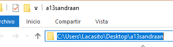
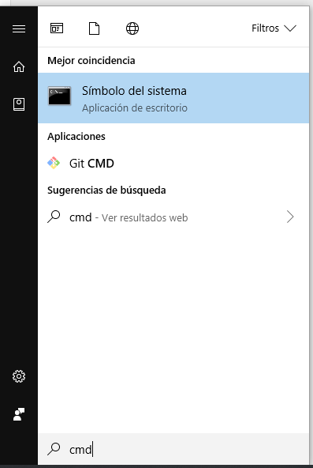
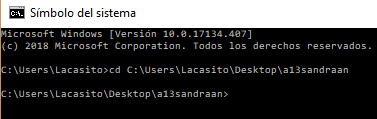
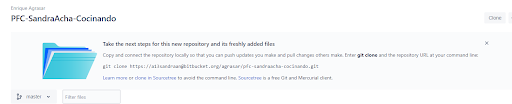
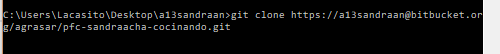
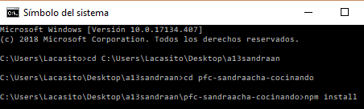
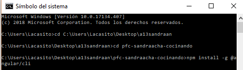
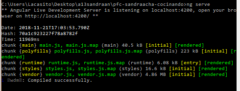

# PfcSandraachaCocinando
The project is licensed under the GNU License.

## ESTRUCTURACIÓN DEL CÓDIGO
Dentro de la carpeta principal del proyecto **“pfc-sandraacha-cocinando”** disponemos de varios ficheros y carpetas de configuraciones y nuestro código que se encuentra dentro de **“src”**.

En esta, ademas de mas ficheros de configuraciones, podemos distinguir el archivo de html principal de la aplicación **“index.html”** y tres carpetas.

* app: Este directorio va a almacenar la web en sí misma, las vistas y las funcionalidades.

* assets: En esta añadiremos los recursos extra y que no forman parte de angular, por ejemplo fuentes, imágenes, ficheros mock de datos, css...

* environments: Aquí podemos ver los ficheros de configuración de los diferentes entornos de ejecución, angular te los crea por defecto, pero en nuestro caso los personalizamos.

Dentro del directorio **“app”** crearemos una estructura para separar los diferentes ficheros que crearemos, según las funcionalidades que desempeñan y las pantallas a las que pertenecen, y los ficheros principales de la aplicación encargados del flujo entre pantallas, idioma y comunicación entre todos los elementos de la estructura. Angular nos crea el primer componente(app.component) enlazado con las rutas configuradas.

* components: Controlan una pantalla o parte de una y su vista, contienen funcionalidades específicas. Los estructuramos por pantallas y cada pantalla en partes de la misma.

* core: Clases con unos propósitos específicos abstraídas de los componentes para fomentar la reutilización y modularidad, separándolos de las funcionalidades principales de los componentes, storages, contants...

* directives: Comportamientos definidos que podemos utilizar en todos los elementos DOM que queramos de la aplicación.

* model: Modelos de los objetos para mostrar y utilizar los datos.

* pipes: Funcionalidades específicas y muy concretas para utilizarse toda la aplicación.

* routes: Fichero de rutas configuradas donde podemos especificar y controlar los accesos mediante los diferentes niveles de acceso o rutas parciales donde solo alteramos una parte de la ruta y la pantalla...

* services: Clases para el acceso a los datos de la aplicación.

## INSTRUCCIONES DE DESPLIEGUE
Descargamos e instalamos git y node de https://git-scm.com/downloads y https://nodejs.org/es/download/.

Creamos el directorio donde vamos a disponer del proyecto y copiamos su url.

Abrimos un cmd y nos movemos a la carpeta.

Clonamos el repositorio ejecutando el comando de git con `git clone https://github.com/sandraacha9/Cocinando.git`

Descargamos los paquetes necesarios para el proyecto e instalamos **@angular/cli** de forma global desde el cmd con `npm install` y `npm install -g @angular/cli`.

Y por ultimo ejecutamos la aplicación y ya podemos acceder a ella desde el navegador a **http://localhost:4200/** con `ng serve`.

*Design and created by Sandra Acha Nine.*
